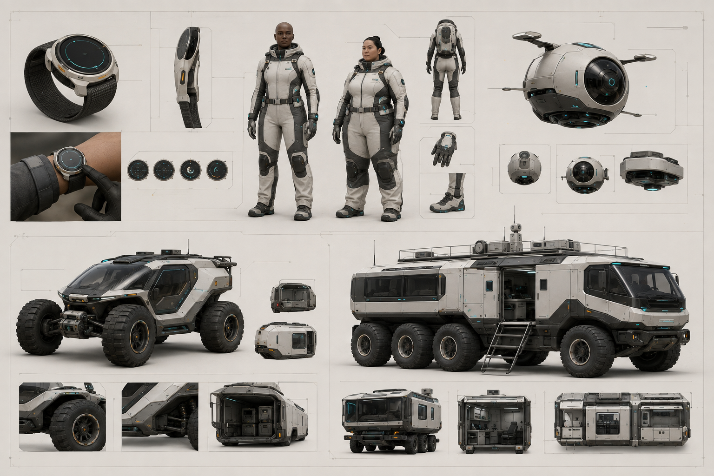
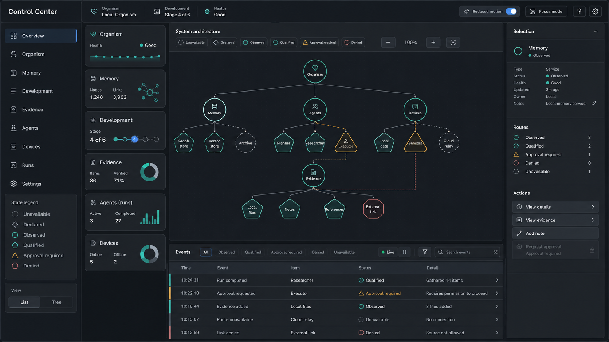
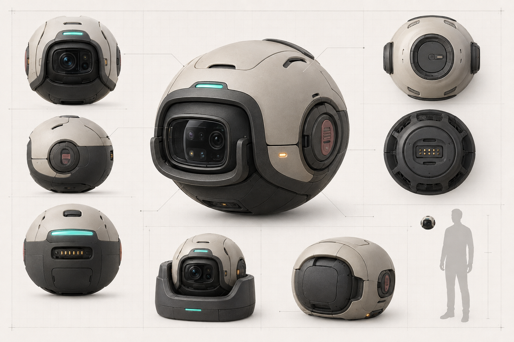
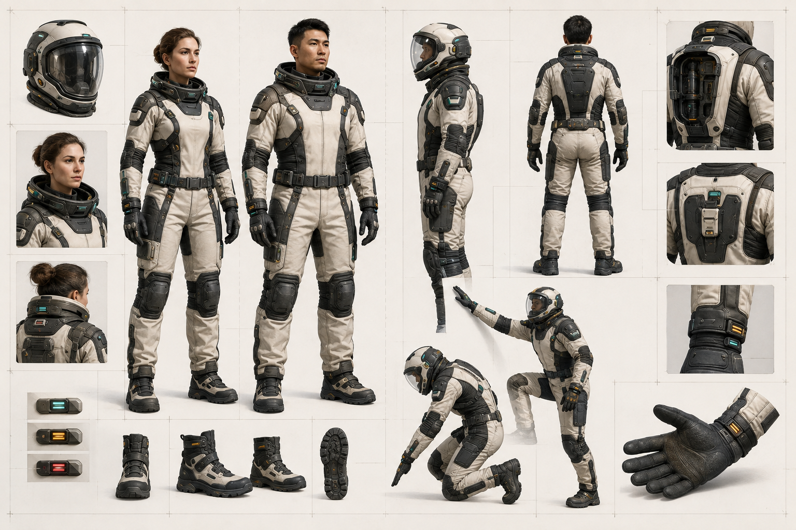

# Genesis Design System and Final-Design Guide

Status: provisional design foundation for Genesis 0.31.0. This guide does not
claim that the Control Center, companion orb, exploration suit, vehicles or
platforms are implemented or physically qualified.

## Design objective

Genesis should feel like one calm, comprehensible organism across software and
embodiment surfaces. The interface language must communicate evidence, authority,
health and uncertainty before spectacle. A person should be able to answer four
questions at a glance:

1. What am I looking at?
2. Who or what owns it?
3. What is its evidence and capability state?
4. What will happen if I act, and is approval required?

The generated boards below are directional references, not product screenshots:









## Permanent principles

- One canonical state: frontends render versioned Genesis data and never maintain
  a competing organism, identity, memory, policy or requirement store.
- Truth before theatre: unavailable operations look unavailable. Observation is
  distinct from qualification; qualification is distinct from authorization.
- Local first: the useful shell remains functional when every cloud adapter is
  absent. Network state and sync debt are visible.
- Human agency: destructive, financial, communicative, credential, account and
  physical actions expose scope, consequences, evidence and approval state.
- Inclusive by construction: touch, pen, mouse, keyboard, switch and assistive
  technology share equivalent commands and outcomes.
- Calm density: complex evidence is progressively disclosed without hiding
  critical denials, uncertainty or degraded state.
- Original expression: named entertainment works may inspire a problem or
  interaction category, never the shipped form, character, costume or brand.
- Concept is not qualification: artwork cannot close implementation, safety,
  hardware, device, model, security or platform gates.

## Visual language

The canonical provisional tokens are in `assets/design/tokens.json`.

### Foundations

- Graphite canvas and layered charcoal surfaces keep long sessions comfortable.
- Warm off-white primary text avoids harsh pure-white contrast.
- Muted teal marks observed or healthy state; qualified state uses its own shape
  and lighter green-teal tone.
- Cyan marks selection and focus, never trust.
- Amber means caution or approval required.
- Rose means denial, invalidity or failure—not merely a decorative accent.
- Borders and spacing carry hierarchy before drop shadows or transparency.

### Evidence-state grammar

Color is always paired with icon shape and text:

| State | Shape | Meaning | Interaction |
|---|---|---|---|
| Unavailable | dashed circle | no usable route/evidence | disabled with explanation |
| Declared | diamond | configuration exists only | inspect declaration |
| Observed | circle | bounded observation exists | inspect evidence and age |
| Qualified | pentagon | qualification is current | still check authorization |
| Approval required | triangle | action is blocked on review | review exact scope/digest |
| Denied | octagon | policy or evidence denied action | show reason and appeal route |

Never use a green dot alone to mean “safe,” “authorized,” “online,” and
“qualified.” Those are different facts.

## Information architecture

The Control Center is a replaceable client over canonical APIs. Its primary
areas are:

| Area | Primary question |
|---|---|
| Overview | Is the organism stable, and what needs attention? |
| Organism | What do anatomy, metabolism, homeostasis and repair report? |
| Memory | What evidence-backed memories and relationships exist for this identity? |
| Development | Which competencies are demonstrated, gated or unavailable? |
| Evidence | What source, provenance, freshness and qualification support a claim? |
| Agents | Which definitions/runs exist, and which authority is absent or pending? |
| Devices | Which shells/routes are declared, observed, qualified or isolated? |
| Laboratory | What is simulated, experimental, falsified or ready for review? |
| Requirements | Which exact gates remain open and why? |
| Settings | What local preferences, accessibility and operator boundaries apply? |

An architecture canvas may show relationships, but a list/tree/table equivalent
is mandatory. Selecting a node opens a contextual inspector with identity,
owner, evidence, state, last observation, dependencies, consumers, failure mode,
recovery route and allowed actions.

## Interaction model

Every command has one semantic action ID regardless of input method.

| Intent | Touch | Pen | Mouse/trackpad | Keyboard/access technology |
|---|---|---|---|---|
| Select | tap | tap | click | focus + Enter/Space |
| Context | long press | barrel/tap-hold | secondary click | context-menu key/Shift+F10 |
| Pan | two-finger drag | drag empty canvas | middle-drag/space-drag | arrow controls |
| Zoom | pinch | explicit zoom control | Ctrl+wheel/control | `+`, `-`, reset |
| Group | multi-select then Group | lasso then explicit Group | multi-select then Group | selection list then Group |
| Inspect | tap selected item | tap selected item | double click/inspector action | focus + inspect command |

Gestures are accelerators, never the only route. Pen pressure cannot be required
for an essential action. Spatial inertia, parallax, hover-only details and
animated depth switch off under reduced motion or constrained input.

## Core screen template

```text
┌ navigation ┬ status and context header ───────────────────────────┐
│            │                                                      │
│ sections   │ primary canvas / list / table        inspector       │
│            │                                                      │
│ state      ├──────────────────────────────────────────────────────┤
│ legend     │ event timeline · evidence age · failures · recovery  │
└────────────┴──────────────────────────────────────────────────────┘
```

Minimum persistent status includes local/offline state, organism identity,
active role, development/competency boundary, unresolved approvals, degraded
subsystems and evidence freshness. A decorative health percentage cannot replace
the underlying facts.

## Responsive surfaces

- Desktop: navigation, primary view and inspector may coexist.
- Tablet: inspector becomes a resizable side sheet; all primary controls remain
  at least 44 CSS pixels.
- Small touch surface: one region at a time with a persistent state/approval bar.
- Wearable: glanceable health, identity, route and approval state only; complex
  actions hand off to a larger verified surface.
- Voice/audio: reads state and consequences but cannot bypass confirmation,
  authentication or accessible visual/text alternatives.
- Embodied device: displays local identity, recording/sensing state, connection
  state, manual disable and fail-safe status on the device itself.

## Embodiment design rules

The companion orb, suit, vehicle and platform share the palette, state grammar,
service access and human-centered curves, but each is a distinct registered
shell. The software must never imply that the shell is the organism itself.

- Protect critical components and avoid snag-prone exposed cabling/tanks.
- Provide visible and tactile manual stop/disable controls.
- Make sensing/recording state apparent to nearby people.
- Default external sensing, movement and actuation to denied until separately
  authorized and qualified.
- Design body-fit variants from measurements and mobility needs, not binary visual
  stereotypes or scaled copies.
- Use no weapon mount language or aggressive target/HUD motifs.
- Validate heat, pressure, loads, visibility, breathing, egress, power failure,
  electromagnetic compatibility, privacy and human factors before physical use.
- Retain a passive/manual exit and safe state when compute or power is lost.

## Content and language

Prefer direct state language:

- “Provider declared; no successful observation recorded.”
- “Observed 12 minutes ago; not qualified for execution.”
- “Approval required for 2 file writes. Review exact paths.”
- “Device route denied: qualification expired.”

Avoid sentient or biological claims unsupported by evidence, such as “I am fully
alive,” “immortal,” “safe,” “conscious,” “all systems operational,” or “100%
complete.” Avoid anthropomorphic reassurance when a concrete error and recovery
path are available.

## Accessibility acceptance criteria

1. Meet WCAG 2.2 AA contrast targets for text and essential graphics.
2. Preserve logical reading/focus order at every responsive breakpoint.
3. Expose programmatic names, roles, values, errors and relationships.
4. Support 200% text zoom without clipped actions or hidden evidence.
5. Provide keyboard access and visible focus for every operation.
6. Pair color with shape and text for all evidence/authority states.
7. Provide reduced-motion, high-contrast and non-spatial alternatives.
8. Never require timing, multi-touch, hover, pressure, drag or fine pointing when
   a simple alternative can produce the same outcome.
9. Announce asynchronous changes without stealing focus.
10. Test with automated tooling and representative human assistive-technology
    workflows before closing the accessibility gate.

## Implementation boundary

A future frontend may use TypeScript or another UI language only after a recorded
architecture decision. It must consume a versioned local API, use generated
schemas, pin dependencies, isolate optional web content, sanitize untrusted text,
and preserve offline operation. The first functional slice should be a read-only
requirements/evidence explorer; approval and mutation arrive only after identity,
authorization, idempotency, audit and recovery contracts exist.

The concept UI includes illustrative values. None are runtime fixtures, benchmark
results, evidence records or completion percentages.

## Asset release checklist

- manifest row and SHA-256 match the exact file;
- origin and prompt/source recorded;
- no unlicensed third-party content or hidden metadata;
- alternate text and non-image explanation exist;
- privacy, bias, inclusion and harmful-symbol review complete;
- dimensions/format/size are appropriate for the consuming surface;
- technical claims are explicitly bounded;
- human approval recorded before public brand or marketing use;
- obsolete versions remain traceable or are removed through a recorded migration.
